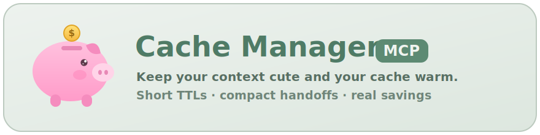
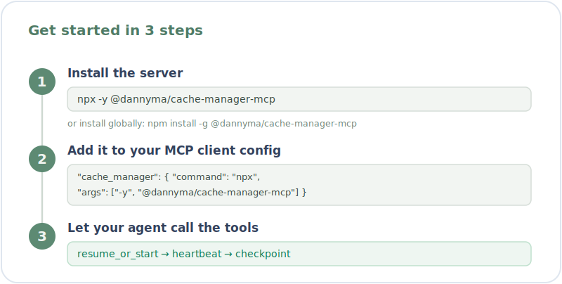

<p align="center">
  
</p>

# Cache Manager MCP Server

A standalone [Model Context Protocol (MCP)] server for agent prompt TTL tracking, conversation handoff memories, aliases, and transcript-derived usage stats. It runs in any stdio-capable MCP client. An optional, thin Zed editor-extension wrapper is provided from the repository root.

## Installation

<p align="center">
  
</p>

Cache Manager is published on npm as [`@dannyma/cache-manager-mcp`](https://www.npmjs.com/package/@dannyma/cache-manager-mcp) and runs in any stdio-capable MCP client. The quickest path needs no install at all.

### Quickest: point your client at `npx`

Drop this into your MCP client config and you're done — `npx` fetches and runs the latest version on demand:

```json
{
  "mcpServers": {
    "cache_manager": {
      "command": "npx",
      "args": ["-y", "@dannyma/cache-manager-mcp"]
    }
  }
}
```

### Or install globally

```sh
npm install -g @dannyma/cache-manager-mcp
```

Then configure your client to launch the installed binary:

```json
{
  "mcpServers": {
    "cache_manager": {
      "command": "cache-manager-mcp",
      "args": []
    }
  }
}
```

The server communicates over stdio and supports standard MCP `Content-Length` framing. It also accepts newline-delimited JSON for local smoke tests.

### From source (for development)

Clone the repo, install, and run the server directly:

```sh
npm install
npm test
node server/cache-manager.mjs
```

Then point your client at an absolute path to the local server:

```json
{
  "mcpServers": {
    "cache_manager": {
      "command": "node",
      "args": ["/absolute/path/to/cache-manager/server/cache-manager.mjs"]
    }
  }
}
```

## How it flows in a chat

The diagram below shows the logical flow of `cache_manager` tool calls across a regular agent chat: the agent resumes context once, heartbeats through the turn loop, and checkpoints at natural cut points — when a substantial work item is finished — so a fresh chat can resume cheaply.

<p align="center">
  
</p>

## What it does

The `cache_manager` MCP server exposes tools agents can call to:

- start/reset a 5 minute prompt TTL session
- record activity heartbeats
- check whether the session is near TTL expiry
- display a countdown/status message via the `countdown` tool
- alert after 4 minutes of no recorded agent activity by default
- generate a handoff-summary prompt
- save compact conversation summaries as markdown memories
- retrieve the latest saved memory in a new session
- search saved memories
- map human-friendly aliases to stable session IDs for older chat/thread restore flows
- report transcript-derived token/cache usage and an estimated USD cost for the current session and the alias's whole lifetime

## How the agent uses it

The workflow ships **with the server**: it is sent to conforming MCP clients via the `instructions` field of the `initialize` response and reinforced in every tool's description, so Cache Manager works **out of the box** — no `AGENTS.md` / `CLAUDE.md` setup needed. Clients that ignore server instructions can paste the minimal snippet from [`AGENTS.md`](AGENTS.md).

Everything is **agent-mediated**: MCP servers are request-driven and cannot observe a conversation, intercept prompts, clear the model's context, open a fresh chat, or force a summary. The server tracks and nudges; the agent makes the calls.

The loop:

1. **Resume** — at the start of a chat, the agent calls `resume_or_start` with a stable `alias`. If a memory is returned, it reads it as restart context before anything else.
2. **Heartbeat (start and end of each chat request)** — at the **start of each chat request** (a new user prompt), the agent calls `heartbeat` with `phase: "start"` so the dashboard shows the chat as **running** (which suppresses the idle/TTL countdown while it works). When it has finished answering that request — after **all** the turns and tool calls needed to respond — it calls `heartbeat` with `phase: "end"` so the idle/TTL countdown resumes. It may also send plain `heartbeat` pings (default `phase: "progress"`) after meaningful steps in between. This feeds the external dashboard/notifier; it is **not** a checkpoint trigger.
3. **Checkpoint at natural cut points** — when the agent finishes a substantial unit of work (a logical stopping point, usually the end of a long task), it calls `checkpoint` with a compact summary (goal, what changed, decisions, next steps). It does **not** checkpoint mid-task or merely because time has passed.
4. **Resume later** — a fresh chat calls `resume_or_start` (or `latest_memory`) with the same `alias` to recover context with fewer tokens.

TTL/idle metrics power the external dashboard and cost visibility only — they are **never** a reason for the agent to checkpoint.

## Optional editor extensions

The core server needs no editor extension — configure it directly in any MCP
client as shown above. For Zed, this repository root can be installed as a dev
extension. It is optional and simply launches the standalone Node server; see
[`extensions/zed/README.md`](extensions/zed/README.md) for install steps and
packaging caveats.

## Tool workflow for agents

Available tools:

- `resume_or_start`: restore the latest memory for an alias/session if available, then start a fresh TTL tracking session in one call. Prefer this for startup/resume flows after an alias has been selected.
- `checkpoint`: save a compact handoff memory and optionally start a fresh TTL session in one call. Call this when you finish a substantial unit of work (a natural cut point, usually the end of a long task) — not mid-task or merely because time has passed. Its response includes a `restart_prompt` that can be pasted into a fresh agent conversation when a real context reset is desired.
- `start_session`: start/reset TTL and idle tracking for a session. If an `alias` is provided without a `session_id`, the alias is slugged into a stable session ID and stored.
- `heartbeat`: record agent activity and return current TTL/idle status. Call with `phase: "start"` at the start of each chat request (a new user prompt) to mark the chat **running** on the dashboard, with `phase: "end"` immediately before the final response text (after all turns answering that request) to close it so the idle/TTL countdown resumes, or omit `phase` (defaults to `progress`) for a plain activity ping after meaningful steps. MCP cannot observe request submission or run tools after the final response is sent, so these calls are agent-mediated. This feeds the external dashboard/notifier; the TTL/idle it returns are not a checkpoint trigger.
- `status`: return the session's current TTL/idle/turn metrics — the same view the external dashboard renders (informational only). At the end of a turn, call this only after an immediately preceding `heartbeat` if a final status/readout is needed.
- `countdown`: render a display-friendly countdown timer with prompt TTL remaining, inactivity time, and alert state. At the end of a turn, call this only after an immediately preceding `heartbeat` if a final timer/readout is needed.
- `handoff_prompt`: generate summarization instructions for the agent.
- `save_memory`: save a compact markdown handoff memory. If called with a new `alias`, the alias is slugged into a stable session ID and stored.
- `latest_memory`: return the newest memory, optionally filtered by `session_id` or `alias`.
- `list_memories`: list saved memories, optionally filtered by `session_id` or `alias`.
- `search_memories`: keyword-search titles, tags, session IDs, and memory content.
- `set_alias`: manually map a human-friendly alias to a session ID. Accepts an optional `project_group` to file the alias under a project (see [Project groups](#project-groups)).
- `resolve_alias`: resolve an alias to its session ID.
- `list_aliases`: list known aliases (each record includes its `project_group`, if set).
- `session_stats`: report transcript-derived token/cache usage and estimated USD cost for the tracking session and the alias's whole lifetime. See [Usage stats and cost](#usage-stats-and-cost).
- `prune_memories`: delete accumulating handoff memories per the retention policy. By default keeps the newest memory per alias and deletes non-latest memories older than 30 days. Also runs automatically on server startup. See [Memory retention](#memory-retention).

Suggested initial call with `resume_or_start`:

```json
{
  "alias": "cache-manager-dev",
  "label": "Cache Manager implementation",
  "ttl_seconds": 300,
  "warn_before_seconds": 45,
  "idle_seconds": 240
}
```

This returns both the latest memory, if found, and a freshly started timer session. The agent should read any returned memory content as restart context before doing substantive work.

To show the timer, call:

```json
{ "alias": "cache-manager-dev" }
```

with the `countdown` tool. The output includes TTL remaining, inactive time, alert countdown, severity, and next-step guidance.

Required per-request ordering (one chat request = one user prompt and the full answer to it):

1. At the **start** of the chat request, call `heartbeat` with `phase: "start"` to mark the chat **running** on the dashboard.
2. While working, optionally send plain `heartbeat` pings (`phase: "progress"`) after meaningful steps.
3. At the **end** of the chat request, call `heartbeat` with `phase: "end"` first, immediately before the final response text — this closes the running turn so the idle/TTL countdown resumes.
4. Only after that `phase: "end"` heartbeat, call `status` or `countdown` if a final status/readout is needed; then send the final response text.
5. Never call `status`/`countdown` as the final tool before final text unless `heartbeat` was called immediately before it.

When you finish a substantial unit of work — a natural cut point, usually the end of a long task — checkpoint it:

1. Call `handoff_prompt` first if you want summarization guidance (optional).
2. Write a concise restart summary (goal, what changed, decisions, next steps).
3. Call `checkpoint` with the summary to save memory and start a fresh TTL session in one call.
4. Directly output the cost insights from `checkpoint` in the same turn. If `checkpoint` is unavailable or does not return sufficient cost detail, call `session_stats` and include the relevant session/alias cost insights.
5. If the user wants a clean context reset, provide the returned `restart_prompt` for a new chat.

The server raises a work-volume `checkpoint_suggested` hint — and bundles a ready-to-use `checkpoint_suggestion` (example handoff prompt + usage/cost stats) in the `heartbeat` response — once a decent chunk of work has accrued since the last checkpoint. Treat it as a convenient prompt to checkpoint at the next natural boundary, not a hard trigger. Don't checkpoint after every small action (file reads, single edits); checkpoint at the end of coherent work items. TTL/idle are dashboard-only and never a checkpoint trigger.

Example `checkpoint` call with a stable alias:

```json
{
  "alias": "cache-manager-dev",
  "title": "Cache Manager handoff",
  "summary": "Goal: ...\nNext: ...",
  "tags": ["handoff", "cache-manager"],
  "restart_session": true
}
```

## Usage stats and cost

`session_stats` reports how many tokens a conversation has spent and what that
usage costs, derived from the agent's own transcript logs. Because there is no
shared identifier between a cache-manager tracking session and an agent
transcript, the bridge is purely by **time window**: usage that falls inside the
window is aggregated.

Transcript sources are pluggable. One ships today:

- **Claude Code** — `~/.claude/projects/<cwd-slug>/*.jsonl`; one record per
  assistant turn, filtered by each line's timestamp. Override the root with
  `CACHE_MANAGER_TRANSCRIPT_DIR`.

It reports two windows (controlled by `scope`: `session`, `alias`, or `both`,
default `both`):

- **`current_session`** — from the tracking session's start to now.
- **`alias_lifetime`** — from the alias's `created_at` to now (additional
  insight into the whole thread).

Call it with the alias (and optionally `scope`, `cwd`, or `all_projects`):

```json
{ "alias": "cache-manager-dev" }
```

Each window reports:

- `turns`, `input_tokens`, `output_tokens`
- `cache_read_tokens`, `cache_creation_tokens`, and `cache_hit_ratio`
  (= `cache_read / (cache_read + cache_creation)`)
- `cold_start_turns` — turns with zero cache read (a full cache miss)
- `ephemeral_5m_tokens` / `ephemeral_1h_tokens` — the cache-creation TTL split
- `models`, `service_tiers`, `sources`, `transcript_files_scanned`
- `cost` — see below

Alongside the per-window stats, `session_stats` also reports `mcp_overhead`
(and `mcp_overhead_summary`) — cache-manager's own token cost. See
[MCP overhead](#mcp-overhead-cache-managers-own-token-cost).

### Cost

The `cost` block estimates spend in USD:

```json
{
  "currency": "USD",
  "estimated_usd": 0.1518,
  "by_component": { "input": 0, "output": 0.0102, "cache_read": 0.0468, "cache_creation": 0.0948 },
  "by_model": { "claude-opus-4-8": 0.1518 },
  "hypothetical_high_miss": {
    "miss_rate": 0.9,
    "estimated_usd": 0.5305,
    "extra_usd": 0.3787,
    "multiplier_vs_actual": 3.4946
  },
  "pricing_note": "USD list prices as of 2026-06; override via CACHE_MANAGER_PRICING"
}
```

- Cost is priced **per model** (with each model's own rates) and summed, so a
  window spanning more than one model is still correct.
- `hypothetical_high_miss` answers "what would this have cost if the cache had
  mostly missed?" It re-prices 90% of `cache_read_tokens` at the full
  (uncached) input rate, holding everything else constant — isolating the
  dominant cache-read discount. `multiplier_vs_actual` shows the blow-up factor.

`checkpoint` (when stats are enabled) appends a compact version of these numbers
to the saved memory under a `=== USAGE STATS (transcript-derived) ===` block,
including a `cost:` line per window, so restart context carries the spend.

### MCP overhead (cache-manager's own token cost)

Running any MCP server is not free: its tool definitions are injected into the
model's context on every request, and every tool call adds a result back into
context. `session_stats` reports this as `mcp_overhead` (plus a readable
`mcp_overhead_summary`) so you can weigh the cost against the benefit honestly.

```json
{
  "pricing_model": "claude-opus-4-8",
  "schema_tax": {
    "tool_count": 16,
    "estimated_tokens_per_request": 2952,
    "turns": 211, "cold_start_turns": 5, "cached_turns": 206,
    "cache_aware_usd": 0.4517,
    "naive_uncached_usd": 3.1144,
    "naive_overstatement_x": 6.8954,
    "pct_of_avg_turn_context": 4.8952
  },
  "largest_tools": [{ "name": "mcp__cache_manager__start_session", "estimated_tokens": 372 }],
  "per_call": { "scope": "this server process only", "total_calls": 3, "est_result_tokens": 2350 }
}
```

> The `schema_tax` block above is real output from this project's own
> `update-project-details` alias (211 turns). `per_call` is illustrative — it is
> empty until the live server has handled calls this process lifetime.

Two costs, measured separately:

- **Schema tax** — the ~16 tool definitions (≈2952 tokens) added to *every*
  request. They live in the cached prefix, so after the first cold turn they
  bill at the **cache-read** rate, not full input. The report prices cold-start
  turns at the cache-creation rate and the rest at cache-read, reusing the same
  cold/cached split as `cost`. `naive_uncached_usd` shows what you'd *wrongly*
  conclude by ignoring caching — several times higher (≈7× on the sample
  above); that gap is exactly why caching matters and why this number isn't the
  headline.
- **Per-call** — tool results re-entering context as input on the next turn
  (results dominate; `resume_or_start`/`checkpoint` return whole memories
  inline). Measured from the bytes the live server actually emitted **this
  process lifetime** (resets on restart). Not priced — cache-read vs input
  attribution across turns isn't knowable from here.

The **benefit** (a restored handoff memory avoiding re-derivation of context
after a restart) is counterfactual and not recoverable from transcripts, so it
is deliberately **not** given a dollar figure — and the cache-savings
`hypothetical_high_miss` above is the value of prompt caching in general, *not*
of cache-manager. Token counts are `chars / 4` estimates (dep-free, no
tokenizer); override the divisor with `CACHE_MANAGER_CHARS_PER_TOKEN` and the
tool-name prefix with `CACHE_MANAGER_TOOL_PREFIX` (default `mcp__cache_manager__`).

### Pricing table

Rates are USD per 1,000,000 tokens and ship as published **list prices as of
2026-06**. Override the whole table or any subset by setting
`CACHE_MANAGER_PRICING` to a JSON object keyed by model id:

```sh
CACHE_MANAGER_PRICING='{"claude-opus-4-8":{"input":5,"output":25,"cacheRead":0.5,"cacheWrite5m":6.25,"cacheWrite1h":10}}'
```

Fields per model: `input`, `output`, `cacheRead`, `cacheWrite5m`, `cacheWrite1h`.
Unknown models fall back to the current Opus rate so cost is never silently
zero; dated-snapshot ids (e.g. `claude-opus-4-8-20260...`) match by prefix.

## Manual fresh-conversation reset flow

Starting a new MCP tracking session does **not** clear the current model/client conversation context. A true context reset requires the user to start a fresh conversation in their MCP client.

When you've just checkpointed at a natural cut point and the user wants a clean context reset (or the live chat has simply grown long), the flow is:

1. The agent creates a compact checkpoint with durable restart context (if it hasn't already at this cut point).
2. The agent does **not** continue substantive implementation/debugging/guidance in the same conversation.
3. The agent shows a copy/paste prompt like:

```text
Resume cache-manager alias `cache-manager-dev`.
Before doing anything else, call cache_manager.resume_or_start with {"alias":"cache-manager-dev","label":"Resumed from checkpoint","ttl_seconds":300,"warn_before_seconds":45,"idle_seconds":240}; read any returned memory content as restart context, then continue with: <next goal>.
```

This is policy-driven: the MCP server cannot technically block AI-server calls, clear a host client's context, or prefill the next conversation.

## Restoring an older chat/thread

Most MCP clients do not expose a stable native chat/thread ID to MCP servers, so exact thread restore is not automatic. Use one of these stable identifiers instead:

- `session_id`: a stable machine-readable ID, such as `cache-manager-dev`.
- `alias`: a human-friendly name, such as `old-thread` or `cache-manager-dev`.
- Search hints: title, tags, keywords, or project names used in saved memories.

Recommended restore flow:

1. If the alias is known, call `latest_memory` with it:

   ```json
   { "alias": "cache-manager-dev" }
   ```

2. If the session ID is known, call `latest_memory` with it:

   ```json
   { "session_id": "cache-manager-dev" }
   ```

3. If neither is known, call `list_aliases`, `search_memories`, or `list_memories` and ask the user to choose when multiple plausible memories are found.
4. Once the right memory is identified, read its content as restart context.
5. Continue tracking with the resolved alias/session:

   ```json
   {
     "alias": "cache-manager-dev",
     "label": "Cache Manager project work",
     "ttl_seconds": 300,
     "warn_before_seconds": 45,
     "idle_seconds": 240
   }
   ```

## Storage

By default, runtime state is stored outside the project at:

```text
~/.cache/cache-manager-mcp/
```

Set `CACHE_MANAGER_STORE_DIR` to use a different location, for example:

```sh
CACHE_MANAGER_STORE_DIR=~/.local/share/cache-manager-mcp cache-manager-mcp
```

Saved memories are markdown files under:

```text
~/.cache/cache-manager-mcp/memories/
```

Session and alias indexes are stored at:

```text
~/.cache/cache-manager-mcp/sessions.json
~/.cache/cache-manager-mcp/aliases.json
```

## Project groups

Aliases can be filed under an optional **project group** so related threads are
tracked together and their cost/savings roll up per project rather than only as
one overall total.

Set a group when you start or tag a thread:

- `resume_or_start` / `start_session`: pass `project_group: "acme-app"`.
- `set_alias`: pass `project_group: "acme-app"` to (re)tag an existing alias.

The group is **sticky** — once set it persists across later calls that omit it;
pass an empty string to clear it. It is stored as `project_group` on each alias
record in `aliases.json`; pre-existing aliases (and any untagged alias) are
treated as **Ungrouped**.

Both dashboards then group their rows by project group and show a per-group
**cost** and **savings** subtotal (savings = the extra cost a 90%-cache-miss run
would have incurred, summed over the group's sessions). The overall
"Saved by cache" total is still shown alongside the per-group breakdown.

## Memory retention

Handoff memories accumulate over time, so the server prunes them automatically.
On startup it deletes old memories, and the same logic is exposed as the
`prune_memories` tool for on-demand cleanup (with a `dry_run` option to preview).

The default policy keeps the **newest memory per alias** — so
`resume_or_start` / `latest_memory` can always restore a thread — and deletes
any *non-latest* memory older than 30 days.

Configure via environment variables:

```sh
CACHE_MANAGER_RETENTION_DAYS=30        # delete memories older than N days (0 disables age pruning)
CACHE_MANAGER_KEEP_LATEST_PER_ALIAS=true  # never delete the newest memory of each alias
CACHE_MANAGER_PRUNE_ON_STARTUP=true    # run the prune automatically when the server starts
```

The `prune_memories` tool accepts per-call overrides: `retention_days`,
`keep_latest_per_alias`, `dry_run`, and `delete_non_latest` (delete every
memory that is not the newest of its alias regardless of age — i.e. "only keep
the latest memory per alias"). The tool **previews by default** (`dry_run: true`);
pass `dry_run: false` to actually delete. For example, to preview keeping only
the latest per alias:

```json
{ "name": "prune_memories", "arguments": { "retention_days": 0, "delete_non_latest": true } }
```

Then re-run with `"dry_run": false` to apply it.

## Local protocol smoke test

Run the automated MCP smoke test:

```sh
npm run smoke:mcp
```

Or run the MCP server manually:

```sh
node server/cache-manager.mjs
```

Then send JSON-RPC messages on stdin, one per line:

```json
{"jsonrpc":"2.0","id":1,"method":"initialize","params":{}}
{"jsonrpc":"2.0","id":2,"method":"tools/list","params":{}}
{"jsonrpc":"2.0","id":3,"method":"tools/call","params":{"name":"start_session","arguments":{"session_id":"demo","ttl_seconds":300}}}
```

## External system notifications

MCP servers generally cannot mount a live host-client timer or send proactive native client notifications. As a practical workaround, this repo includes an optional external notifier process that watches the same session store used by the MCP server and sends OS-level notifications.

Run it from this repository:

```sh
node server/cache-manager-notifier.mjs
```

The notifier polls `~/.cache/cache-manager-mcp/sessions.json` by default. It sends:

- a 3-minute inactivity warning when no heartbeat has been recorded for 180 seconds,
- a 4-minute inactivity alert when no heartbeat has been recorded for 240 seconds,
- and, at the 4-minute alert, shows a popup nudging you to ask the agent to checkpoint the chat. Copying the handoff prompt to the system clipboard is opt-in (`CACHE_MANAGER_NOTIFY_COPY_ON_IDLE=true`); with the web dashboard you usually don't need it.

On macOS it uses `osascript` for notifications and `pbcopy` for clipboard writes. On Linux it tries `notify-send` plus `wl-copy`, `xclip`, or `xsel`. On Windows it tries PowerShell notification support plus `clip`.

Configuration environment variables:

```sh
CACHE_MANAGER_STORE_DIR=~/.cache/cache-manager-mcp
CACHE_MANAGER_NOTIFIER_ENABLED=true
CACHE_MANAGER_NOTIFY_POLL_SECONDS=10
CACHE_MANAGER_NOTIFY_IDLE_WARNING_SECONDS=180
CACHE_MANAGER_NOTIFY_IDLE_SECONDS=240
CACHE_MANAGER_NOTIFY_COPY_ON_IDLE=false
CACHE_MANAGER_NOTIFY_CLICK_TO_COPY=false
CACHE_MANAGER_NOTIFY_DELIVERY=auto
```

`CACHE_MANAGER_NOTIFY_DELIVERY=log` prints notifications to stdout instead of sending OS notifications, which is useful for tests.

For a one-shot check, useful in smoke tests:

```sh
node server/cache-manager-notifier.mjs --once
```

Run the no-notification smoke test:

```sh
node scripts/smoke-notifier.mjs
```

For automatic background startup on macOS, see [`docs/macos-launchagent.md`](docs/macos-launchagent.md). The template LaunchAgent lives at [`docs/launchagents/com.cache-manager.notifier.plist`](docs/launchagents/com.cache-manager.notifier.plist).

For optional click-to-copy notifications on macOS, install `terminal-notifier` and run with:

```sh
CACHE_MANAGER_NOTIFY_CLICK_TO_COPY=true CACHE_MANAGER_NOTIFY_COPY_ON_IDLE=false node server/cache-manager-notifier.mjs
```

The notifier deduplicates alerts in:

```text
~/.cache/cache-manager-mcp/notifier-state.json
```

This is still based on cache-manager heartbeats, not true host-client UI activity. It cannot automatically observe chat messages, create a new chat tab, prefill a prompt box, or know a native chat/thread ID.

## Countdown dashboard

For a live, at-a-glance view of every tracked session's countdown, run the dashboard. Like the notifier, it watches the same session store but renders a continuously refreshing terminal table instead of firing OS notifications:

```sh
node server/cache-manager-dashboard.mjs
# or
npm run dashboard
```

Each row shows the alias/label, TTL remaining, the current/latest turn timer, idle time, severity (`running` / `ok` / `idle` / `near_ttl` / `ttl_and_idle` / `expired`), and the last action timestamp, color-coded by severity. The footer summarizes session counts per severity and appends `checkpoint-due:N` when any session has accrued enough work to warrant a proactive checkpoint (see below). Press Ctrl-C to exit.

A session is `running` when the agent has opened a turn via `heartbeat phase:"start"` and not yet closed it with `phase:"end"`. While running, the `TTL LEFT` column shows `▶ running` (the countdown is suppressed because active work keeps the cache warm) and the `TURN` column shows the live elapsed time (`▶ 0:42`); once the turn ends, `TURN` freezes at that turn's duration and the TTL countdown resumes. The live timer has **no idle/TTL ceiling** — because the dashboard reads stored state without heartbeating, gating `running` on `idle`/`expired` used to make any turn longer than the idle window (~5 min) silently drop the badge and reset the elapsed display to the prior turn's duration. Instead, `running` is driven purely by the stored turn flag, bounded only by a generous **max-turn safety valve** (default 60 min, override with `turn_max_seconds`): a turn older than that self-heals back to non-running, and the next `phase:"start"` resets a stale turn's start time so a forgotten `phase:"end"` can't poison the next turn's elapsed.

### Proactive checkpoint hint

Independently of TTL/idle pressure, the server tracks work accrued since the last checkpoint and raises a **checkpoint hint** when a handoff would be a cheap, natural move. `status`, `heartbeat`, and `countdown` expose `checkpoint_suggested` (boolean) and `checkpoint_reason`. It fires after **≥ 20 heartbeats** or **≥ 30 minutes** since the last checkpoint (override per session with `checkpoint_after_actions` / `checkpoint_after_minutes`), and is suppressed while a turn is `running` or while `should_summarize` is true. When it fires, the `heartbeat` response bundles `checkpoint_suggestion` — `{ reason, handoff_prompt, stats, stats_text, next_step }` — so the agent can checkpoint in one shot with an example restart prompt and usage/cost stats already assembled. `checkpoint` and `save_memory` reset the counter, re-arming the hint. A checkpoint is never fully automatic (the summary needs the agent), so this is an agent-triggered, one-call checkpoint: the server nudges and pre-assembles, the agent writes the summary and makes the call.

Note that the TTL is a **sliding window**: it resets to the full TTL on every heartbeat (anchored to `ttl_anchor_ms`), so the countdown climbing back up to 5:00 after a heartbeat is expected, not a bug. The dashboard imports the same status math the MCP server uses (`server/session-status.mjs`), so what it shows always matches the `status`/`countdown` tools.

Configuration:

```sh
# Refresh interval in seconds (default 1)
CACHE_MANAGER_DASHBOARD_REFRESH_SECONDS=2 node server/cache-manager-dashboard.mjs

# Point at a non-default store
CACHE_MANAGER_STORE_DIR=/path/to/store node server/cache-manager-dashboard.mjs
```

Render a single frame and exit (useful for scripts/CI; emits plain text with no ANSI escapes when piped):

```sh
node server/cache-manager-dashboard.mjs --once
```

Smoke test:

```sh
node scripts/smoke-dashboard.mjs
```

## Web dashboard

The MCP server also launches a **web dashboard** automatically on startup — a minimalist, auto-refreshing browser view (pink + green, matching the banner) of every tracked session. When the agent calls `resume_or_start` (or `start_session`), the response includes a `dashboard_url` and a `dashboard_hint`, so the agent can surface the localhost link to you:

```
http://127.0.0.1:41734
```

It serves a single page (`/`) that polls a JSON endpoint (`/api/sessions`) and renders one card per session — alias/label, TTL/turn/idle, turns, tokens, cost, savings, severity, and last activity — grouped into [project-group](#project-groups) sections each with a cost/savings subtotal, plus a summary strip (sessions, active, running, total cost, saved-by-cache). It is **read-only** and reuses the exact same row-building logic as the terminal dashboard (`server/dashboard-data.mjs`), so the numbers always agree with the `status`/`session_stats` tools.

Each state has its own accent colour, with a legend at the top so it is obvious at a glance: **running** (a brighter green than the resting "ok" green, with a pulsing badge), **idle** (amber), **near ttl** (orange), and **expired** (red). To keep the main view focused on live work, **expired** aliases are collapsed behind a **"See N more expired"** toggle — only the single most-recent expired alias is kept in the main grid (handy if you need to jump back into the last thing you were doing).

**Click any card to copy a restart prompt** to your clipboard — a ready-to-paste message that resumes that chat in a fresh MCP client from its most recent saved memory. The prompt is built by the same shared template the MCP server's `restart_prompt` uses, so the two never drift. If an alias has no saved memory, the card flags `⊘ no saved memory — can't restart` instead of copying (there is nothing to restore from).

Because MCP clients spawn their own server but share the default store, the **first process to bind the port serves every session sharing that store dir**; the rest detect the port is taken and simply reuse the same URL. (If you run projects with a per-project `CACHE_MANAGER_STORE_DIR`, that reused dashboard only reflects the store of whichever instance bound the port first — run `npm run dashboard:web` standalone with an explicit `CACHE_MANAGER_DASHBOARD_PORT` per store to view each one.) The server binds `127.0.0.1` only — it is a local dev tool, never exposed to the network.

**Failover:** the dashboard's lifetime is *not* tied to the chat that happened to launch first. Every non-owning instance keeps re-attempting the bind in the background (every `CACHE_MANAGER_DASHBOARD_RETRY_MS`, default 3s). When the current owner exits and frees the port, the next instance transparently takes over — so the dashboard stays up at the same URL as long as **any** tracked chat is alive. The retries are unref'd (they never hold a process open) and stop the instant a bind succeeds. Set `CACHE_MANAGER_DASHBOARD_RETRY_MS=0` to disable failover.

Run it standalone (e.g. without an MCP client attached):

```sh
node server/cache-manager-web.mjs
# or
npm run dashboard:web
```

Configuration:

```sh
# Disable the auto-launched dashboard entirely
CACHE_MANAGER_WEB_DASHBOARD=0 node server/cache-manager.mjs

# Change the port (default 41734)
CACHE_MANAGER_DASHBOARD_PORT=8080 node server/cache-manager-web.mjs

# Failover re-bind cadence in ms (default 3000); 0 disables takeover
CACHE_MANAGER_DASHBOARD_RETRY_MS=0 node server/cache-manager.mjs
```

Smoke test:

```sh
node scripts/smoke-web-dashboard.mjs
node scripts/smoke-dashboard-failover.mjs
```

## Native client notifications

The current `countdown` tool is request-driven: it displays timer state when the agent calls it, but it cannot independently trigger a native client notification or mount a continuously ticking status widget inside the host client.

Proactive, in-client notifications would require the MCP host to expose native extension notifications, status items, agent lifecycle hooks, or MCP server-originated notifications — none of which the request/response MCP model provides today. The external OS notifier above is the practical workaround in the meantime.

## Future improvements

- Add a small installer script that fills in and loads the macOS LaunchAgent template automatically.
- Replace polling with proactive behavior if host clients expose native notifications, status items, or agent lifecycle hooks.
- Add a `restore_thread` helper that combines alias resolution, latest-memory lookup, and session start.
- Add project-scoped memory stores.
